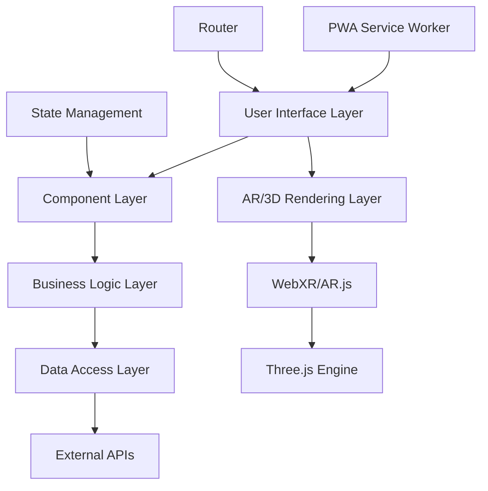

# EV-AR Application Architecture

## System Overview

The EV-AR application follows a modern web architecture pattern optimized for AR experiences and cross-platform compatibility.

## High-Level Architecture



## Layer Descriptions

### 1. User Interface Layer
**Technologies**: React 18, TypeScript, Tailwind CSS

**Responsibilities**:
- User interaction handling
- Responsive design implementation  
- Accessibility features
- Progressive Web App capabilities

**Key Components**:
- `Header.tsx` - Global navigation
- Page components for each feature area
- Reusable UI components

### 2. AR/3D Rendering Layer
**Technologies**: Three.js, React Three Fiber, AR.js, WebXR

**Responsibilities**:
- 3D model loading and rendering
- AR tracking and overlay
- Camera feed integration
- Performance optimization

**Architecture**:
```
WebXR API
    ↓
AR.js Wrapper
    ↓
Three.js Scene
    ↓
React Three Fiber
    ↓
React Components
```

### 3. Business Logic Layer
**Responsibilities**:
- EV model data processing
- Charging station logic
- Maintenance guide workflows
- Comparison algorithms

### 4. Data Access Layer
**Responsibilities**:
- API integration
- Local storage management
- Offline data caching
- Real-time data updates

## Component Architecture

### Page-Level Components

#### ARShowroom
```typescript
interface ARShowroomProps {
  models: EVModel[]
  selectedModel: string
  onModelChange: (model: string) => void
}
```

**Features**:
- 3D model viewer with orbit controls
- Real-time customization options
- AR mode activation
- Model specification display

#### ChargingStations  
```typescript
interface ChargingStationProps {
  userLocation: Coordinates
  searchRadius: number
  filters: StationFilters
}
```

**Features**:
- Interactive map integration
- Real-time availability data
- AR navigation overlays
- Station filtering and search

### Reusable Components

#### 3D Model Viewer
```typescript
interface ModelViewerProps {
  modelUrl: string
  color: string
  scale: number
  controls: boolean
  arEnabled: boolean
}
```

## Data Flow Architecture

### State Management Pattern
```
User Action → Component State → Business Logic → Data Layer → External API
     ↓
UI Update ← Component Re-render ← State Update ← Response Processing ← API Response
```

### AR Data Pipeline
```
Camera Feed → AR Tracking → 3D Scene → Model Overlay → User Interface
```

## Performance Architecture

### 3D Rendering Optimization
- **Level of Detail (LOD)**: Multiple model resolutions based on distance
- **Frustum Culling**: Only render objects in view
- **Texture Compression**: Optimized texture formats
- **Geometry Instancing**: Efficient repeated object rendering

### AR Performance Strategy
- **Frame Rate Targeting**: Maintain 30+ FPS minimum
- **Memory Management**: Efficient texture and geometry cleanup
- **Background Processing**: Offload computations to Web Workers
- **Progressive Loading**: Load models in stages

## Security Architecture

### Data Protection
- **HTTPS Only**: All communications encrypted
- **Input Validation**: Client and server-side validation
- **XSS Protection**: Content Security Policy implementation
- **Camera Permissions**: Secure AR camera access

### Privacy Considerations
- **Location Data**: Minimal collection, local processing
- **User Preferences**: Local storage only
- **Analytics**: Anonymous usage data only
- **AR Sessions**: No recording or storage

## Scalability Architecture

### Frontend Scalability
- **Code Splitting**: Route-based chunking
- **Lazy Loading**: On-demand component loading
- **Service Workers**: Offline capability and caching
- **CDN Integration**: Static asset distribution

### Performance Monitoring
- **Core Web Vitals**: LCP, FID, CLS tracking
- **3D Performance**: Frame rate and memory usage
- **AR Metrics**: Tracking accuracy and stability
- **User Experience**: Interaction success rates

## Deployment Architecture

### Build Pipeline
```
Source Code → TypeScript Compilation → Bundle Optimization → Asset Optimization → PWA Manifest → Production Build
```

### Hosting Strategy
- **Static Hosting**: Netlify/Vercel for optimal performance
- **CDN**: Global asset distribution
- **HTTPS**: SSL certificate for WebXR compatibility
- **Progressive Enhancement**: Graceful AR fallbacks

## API Integration Architecture

### External Services
```typescript
interface ExternalAPIs {
  evDatabase: EVSpecificationAPI
  chargingStations: ChargingNetworkAPI
  maps: MapboxAPI
  analytics: AnalyticsAPI
}
```

### Error Handling Strategy
- **Network Failures**: Offline fallbacks
- **AR Failures**: 3D-only mode fallback
- **API Errors**: Cached data usage
- **Browser Compatibility**: Progressive enhancement

## Testing Architecture

### Testing Pyramid
```
E2E Tests (AR Workflows)
    ↓
Integration Tests (Component + AR)
    ↓
Unit Tests (Business Logic)
    ↓
Visual Regression Tests (UI)
```

### AR-Specific Testing
- **Device Testing**: Multiple camera configurations
- **Browser Testing**: WebXR compatibility matrix
- **Performance Testing**: Frame rate validation
- **Accuracy Testing**: AR tracking precision

## Monitoring & Analytics

### Application Metrics
- **Performance**: Bundle size, load times, frame rates
- **Usage**: Feature adoption, session duration
- **Errors**: JS exceptions, AR failures, API errors
- **User Experience**: Conversion rates, task completion

### AR-Specific Metrics
- **Session Success Rate**: Percentage of successful AR sessions
- **Tracking Quality**: AR tracking accuracy measurements
- **Device Performance**: FPS and memory usage by device
- **Feature Usage**: AR vs 3D mode preferences

## Future Architecture Considerations

### Planned Enhancements
- **WebAssembly Integration**: Performance-critical AR computations
- **Edge Computing**: Reduced latency for real-time features
- **AI/ML Integration**: Smart recommendations and optimizations
- **Multi-User AR**: Collaborative AR experiences

### Scalability Roadmap
- **Microservices**: Backend service decomposition
- **Global CDN**: Worldwide performance optimization
- **Real-time Updates**: WebSocket integration for live data
- **Advanced Caching**: Intelligent predictive caching

---

This architecture provides a solid foundation for a production-ready EV AR application while maintaining flexibility for future enhancements and scalability requirements.